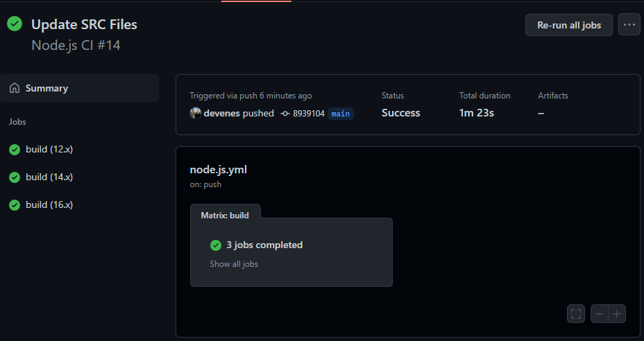

# Node Server with Express

[](https://github.com/devenes/node-js-ci/actions/workflows/node.js.yml) [](https://github.com/devenes/node-js-ci/actions/workflows/docker.x.yml) [](https://github.com/devenes/node-js-ci/actions/workflows/node.js.scan.yml)  

## Continuous Integration with Node.js using GitHub Actions



### Define your branch name and the actions you want to trigger to start your job

- Push

  ```
  push:
    branches: [main]
  ```

- Pull Request

  ```
  pull_request:
    branches: [main]
  ```

### Define your job name and the environment to build your code

```
jobs:
    build:
        runs-on: ubuntu-latest
```

### Define the Node versions to test your code on

```
strategy:
    matrix:
        node-version: [12.x, 14.x, 16.x]
```

### Define your CI steps under your job

```
steps:
    - uses: actions/checkout@v3
    - name: Use Node.js ${{ matrix.node-version }}
      uses: actions/setup-node@v3
      with:
        node-version: ${{ matrix.node-version }}
        cache: "npm"
    - run: npm ci
    - run: npm run build --if-present
    - run: npm test
```
